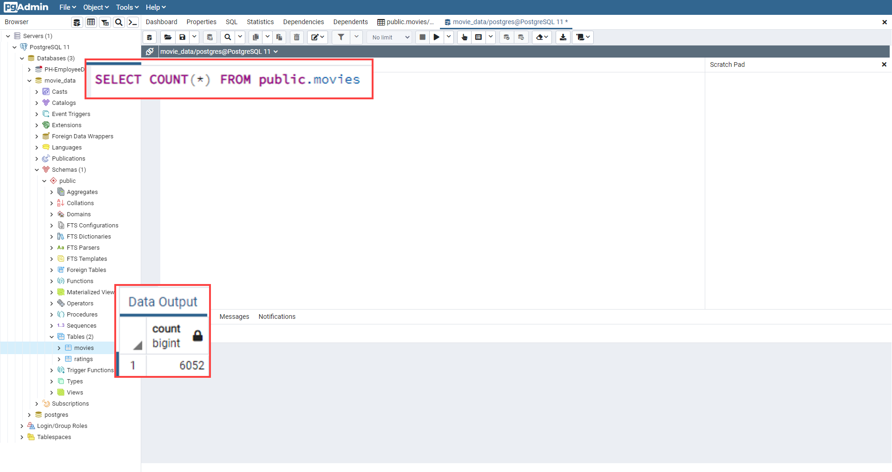
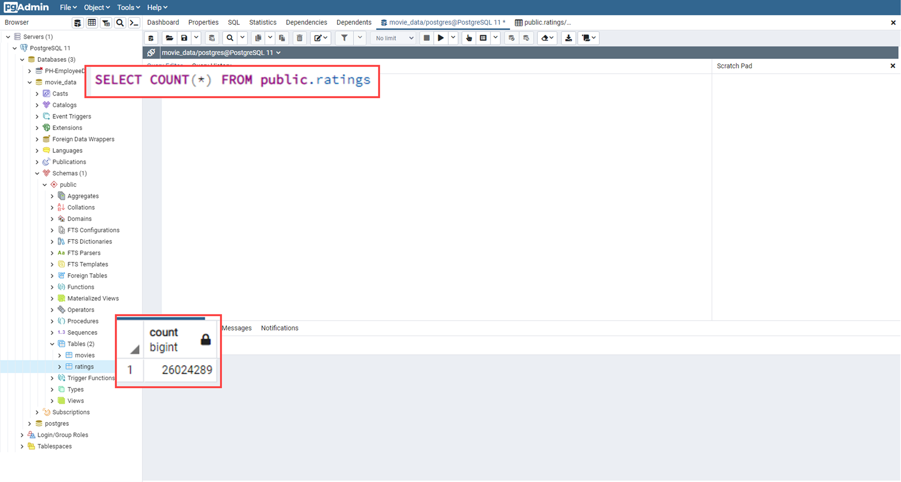

# Movies ETL (Extract, Transform, Load) 

## Background

The Extract, Transform, and Load (ETL) process is used to create data pipelines in this module. The ETL process creates data pipelines that transform data as it travels from one location to another. In order to perform analysis, one must first set up a pipeline of data that can be used for analysis. As a result, the ability to perform data analysis without the use of ETL is extremely limited.

## Project Overview

To find out which low-budget films will go viral, Amazing Prime, a streaming service, is hosting a hackathon in which participants must guess which ones will be the most successful. Predictive models can only be built with an ETL pipeline. The goal of this project is to create an ETL pipeline that can be refactored to process large datasets into a SQL database.

The goals of this challenge are to:

    - Create an automated ETL pipeline.
    - Extract data from multiple sources.
    - Clean and transform the data automatically using Pandas and regular expressions.
    - Load new data into PostgreSQL.

## Results

**Extract Phase** - Data from two different file formats, csv and json, is read into the Python environment using Pandas.
    

**Transform Phase** A dataset that can be loaded into the database has been transformed into a usable dataset. It was necessary to look for and deal with any missing or null values, deal with corrupt data, and format the cleaned data. After that, the data was cleaned up, formatted, and organized into manageable groups before being merged.

**Load Phase**- A connection to the database was established in the Python environment and the final dataset was loaded into two SQL tables.

### Movies Table Query 

Below is the table for movies query. This table contains 6052 rows of movies metadata.

### Ratings Table Query 

The following table is for ratings query. There are 24024289 rows of ratings data in this table.

